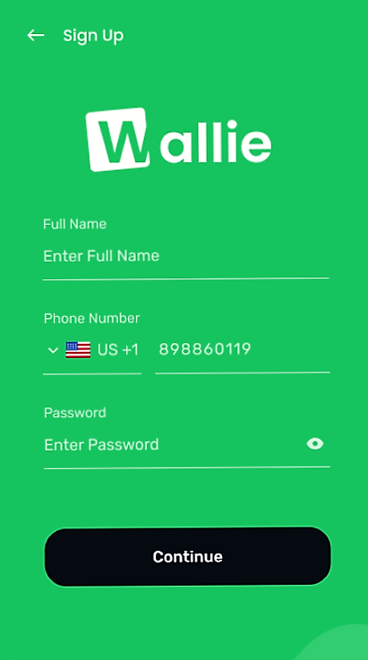

<p align="center">
  
</p>


# Wallie

Web site da aplicação wallie, que é um app de gerenciamento e pagamento de despesas.

<p align="center">
  
  
  
</p>

Caso deseje rodar na sua máquina, digite:

```
git clone https://github.com/Matheus-SS/DigitalWalletWeb.git
```

Instale todas a dependencias na pasta raiz chamada, digitalwalletweb, digite `yarn start` que irá abrir a aplicação.

> > Esse projeto está sob a licença MIT. Veja o arquivo [LICENSE](https://github.com/Matheus-SS/DigitalWalletWeb/blob/master/LICENSE) para mais detalhes.
